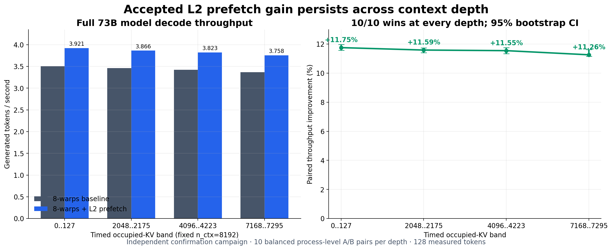
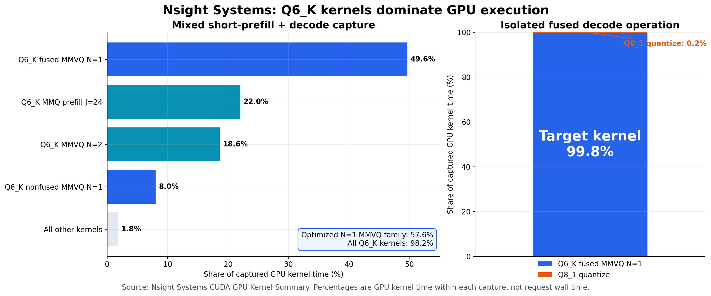
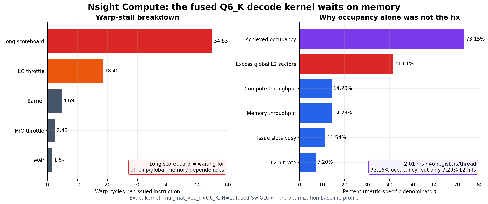
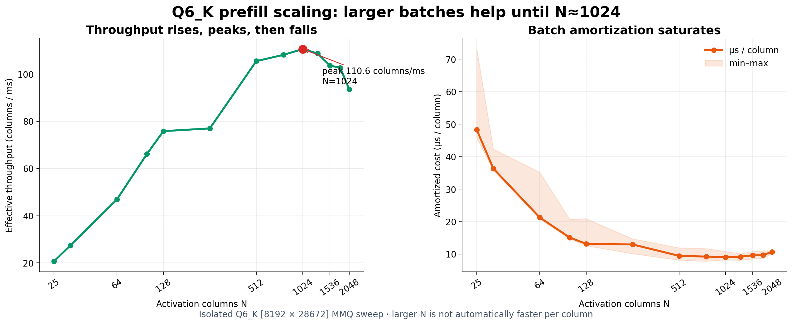

# K2-Think-V2 inference optimization on llama.cpp

This repository documents a measured CUDA inference-optimization project for
K2-Think-V2 Q6_K on NVIDIA GB10 / DGX Spark, plus the verified launcher and
reasoning-budget fix used to serve the model.

## Final optimization result

The accepted patch changes the GB10-only Q6_K single-token matrix-vector decode
kernel in two ways: it uses eight warps and prefetches the next Q6_K weight
blocks into GPU L2 at byte offsets 0 and 128.

- Eight warps separately improved full-model generation by **4.67%**.
- L2 prefetch then improved the already-eight-warp full model from 3.549480 to
  3.920885 tok/s: **+10.4636% throughput** and approximately **9.47% less
  steady decode time per token**.
- Independent fixed-8192-context confirmation measured **+11.7542%** at the
  shallow band and **+11.2610%** at the 7168-token band, with 10/10 wins at
  every tested depth.
- No prefill optimization passed the correctness and performance gates.

The two decode gains were measured in separate campaigns; this repository does
not claim an unmeasured upstream-to-final combined percentage. Read
[`docs/final-results.md`](docs/final-results.md) for the complete quantitative
summary, accepted configuration, rejected candidates, and reproduction links.

The ready-to-apply patch is
[`patches/q6k-gb10-decode-final.patch`](patches/q6k-gb10-decode-final.patch).

## Results at a glance



The accepted L2 prefetch remains effective from an empty KV cache through the
7168-token band. Every depth won all ten independent confirmation pairs.



Nsight Systems shows why this narrow kernel change matters: the optimized
Q6_K `N=1` MMVQ family accounts for 57.6% of GPU kernel time in the mixed
capture, and the exact fused kernel accounts for 99.8% of its isolated decode
operation.



Nsight Compute identifies long-scoreboard memory dependency stalls as the
dominant bottleneck despite 73.15% achieved occupancy. That evidence motivated
requesting the next Q6_K weight lines into L2 before demand.



The isolated prefill sweep also shows that larger input batches are not
unconditionally better: effective throughput peaks near `N=1024` and falls at
larger sizes. See [`docs/visual-results.md`](docs/visual-results.md) for exact
sources, caveats, and regeneration instructions.

## Repository contents

- `patches/`: the consolidated production patch and historical eight-warp
  stage.
- `docs/`: the final summary, kernel analysis, profiler interpretation, and
  experiment log.
- `results/`: curated result/resource/provenance reports and compact
  machine-readable long-context summaries.
- `src/` and `scripts/`: the bounded Q6_K microbenchmarks and analysis tools.

Large GGUF shards, isolated llama.cpp copies, build trees, raw profiler
captures, and raw timing logs are intentionally excluded. Set `LLAMA_CPP_ROOT`,
`LLAMA_SERVER`, `K2_MODEL`, and optionally `Q6K_BUILD_DIR` to use the scripts on
another machine.

## Serving result

The GGUF is not missing its official template or stop tokens. The failure is an unbounded reasoning phase combined with an ineffective `reasoning_effort="low"` request.

The smallest supported fix is llama.cpp's reasoning-budget sampler. It forces the model through the closing reasoning tag while leaving enough generation tokens for a visible final answer and `<|im_end|>`.

Start the server:

```bash
./run-k2-server.sh
```

In another terminal, run the assertion-based client:

```bash
./client_test.py
```

The production default is a 512-token reasoning budget. Override it without editing the script if needed:

```bash
K2_REASONING_BUDGET=1024 ./run-k2-server.sh
```

Keep `max_tokens` larger than the reasoning budget so the model has room to emit its final answer. The fast test deliberately overrides the per-request budget to 32 and uses `max_tokens=96`.

## Diagnosis

Inspected setup:

- llama.cpp build `10380`, commit `0b1bad14f`, Linux ARM64 with CUDA.
- Cached `benjaminradio/K2-Think-V2-GGUF` Q6_K snapshot `3064ec56b7c735f4f133aa10cfcca3ef3bd718f7`; four shards, 55.43 GiB total.
- Official source: `LLM360/K2-Think-V2` (the Hugging Face commits are authored by the IFM team).

GGUF versus official tokenizer/template:

- The embedded `tokenizer.chat_template` differs from the official `chat_template.jinja` only by a final newline.
- GGUF and official tokenizer both use BOS ID `0` (`<|begin_of_text|>`) and EOS ID `1` (`<|end_of_text|>`).
- `<|im_start|>` is ID `250018`; `<|im_end|>` is ID `250019`.
- llama.cpp's startup token dump marks IDs `1`, `250003`, and `250019` as EOG. `ignore_eos` is false. Stop-token configuration is therefore correct.

Exact rendered prompts for the test message:

```text
default:
<|im_start|>user
What is 2+2? Reply with only the answer.<|im_end|>
<|im_start|>assistant
<think>

OpenAI reasoning_effort="low":
<|im_start|>user
What is 2+2? Reply with only the answer.<|im_end|>
<|im_start|>assistant
<think>

chat_template_kwargs.reasoning_effort="low":
<|im_start|>user
What is 2+2? Reply with only the answer.<|im_end|>
<|im_start|>assistant
<think_faster>
```

This llama.cpp version documents and implements only `reasoning_effort="none"`; other OpenAI `reasoning_effort` values are ignored. Passing `reasoning_effort` through `chat_template_kwargs` does alter the template, but llama.cpp's differential reasoning parser detects only `<think>...</think>` for this template, not the alternative `<think_fast>` or `<think_faster>` pair. Use the standard high-effort tag plus `reasoning_budget_tokens` instead.

The controlled failure in [results/repro-length.json](results/repro-length.json) has the correct `4` in `reasoning_content`, empty visible `content`, and `finish_reason="length"`. The fixed run in [results/fixed-stop.json](results/fixed-stop.json) has visible `content="\n4"` and `finish_reason="stop"`.

No model files, llama.cpp sources, CUDA installation, or drivers were changed.

## Q6_K kernel profiling

The isolated Q6_K benchmark now supports bounded variable columns and repeated timing. See [the verified column sweep](docs/q6k-column-sweep.md) for commands, results, actual kernel specializations, and the representative Nsight Compute follow-up.

Decode profiling and the accepted DGX-Spark-only Q6_K decode patch are in
[the decode analysis](docs/q6k-decode-analysis.md). It combines the eight-warp
N=1 mapping with distance-one L2 prefetches at offsets 0 and 128. Against the
eight-warp baseline, full-model generation improved by 10.4636% (3.549480 to
3.920885 tok/s median); the two fused microbenchmark repeats improved by 14.49%
and 14.44%. The upstream llama.cpp tree was left unchanged; the consolidated
ready-to-apply patch is
[`patches/q6k-gb10-decode-final.patch`](patches/q6k-gb10-decode-final.patch).

The later cooperative full-FFN megakernel prototype was correct and memory-safe
but 4.3-4.7% slower than the accepted graph, including a 48-register/five-CTA
occupancy follow-up. It was rejected; the complete report is
[`results/q6k-decode-ffn-megakernel/RESULT.md`](results/q6k-decode-ffn-megakernel/RESULT.md).

Two exact-size Q6_K field-SoA repacks were also implemented. The first aligned
`ql` and retained an 82-byte tail; the second separated `ql`, `qh`, scales, and
deltas completely. Both preserved every quantized byte, produced byte-identical
GPU output, and passed sanitizer, but measured only +0.77% and +0.61% paired
median with 6/10 wins and intervals crossing zero. They were rejected without
changing production; see
[`results/q6k-decode-q6-soa/RESULT.md`](results/q6k-decode-q6-soa/RESULT.md) and
[`results/q6k-decode-q6-full-soa/RESULT.md`](results/q6k-decode-q6-full-soa/RESULT.md).

## References

- Official model: https://huggingface.co/LLM360/K2-Think-V2
- Official template: https://huggingface.co/LLM360/K2-Think-V2/blob/main/chat_template.jinja
- Official tokenizer configuration: https://huggingface.co/LLM360/K2-Think-V2/blob/main/tokenizer_config.json
- Local llama.cpp endpoint/parameter documentation: `/home/dvijraicha/llama.cpp/tools/server/README.md`
