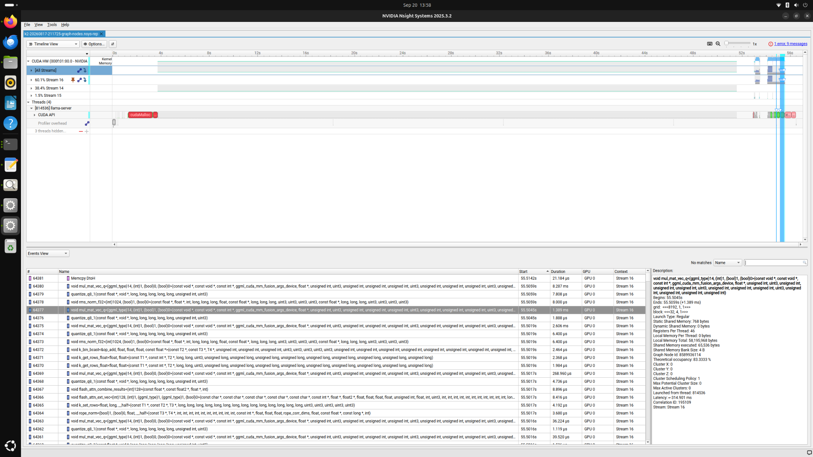
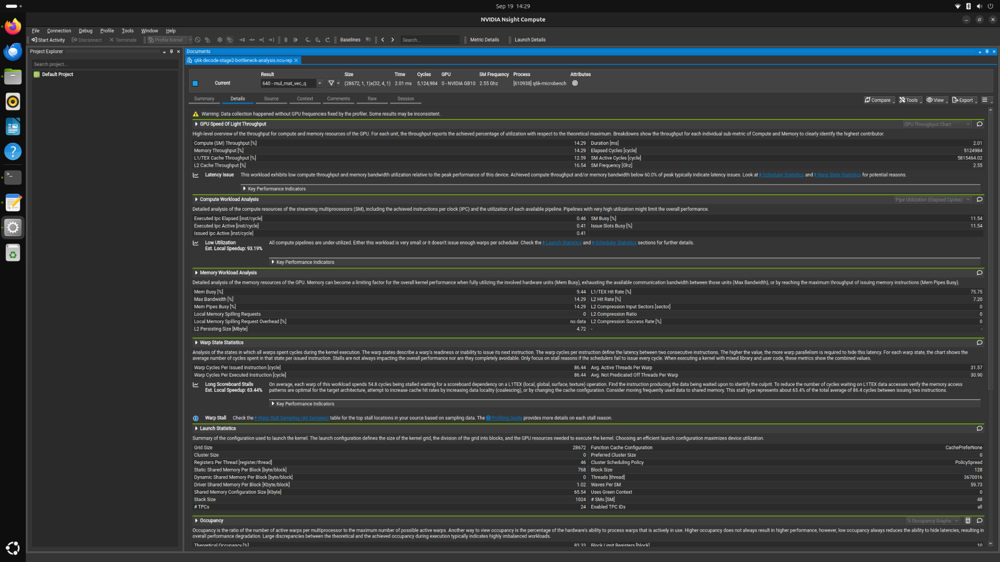
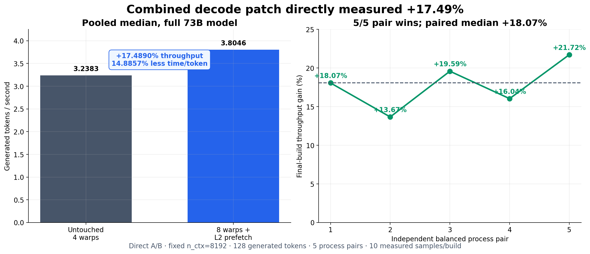
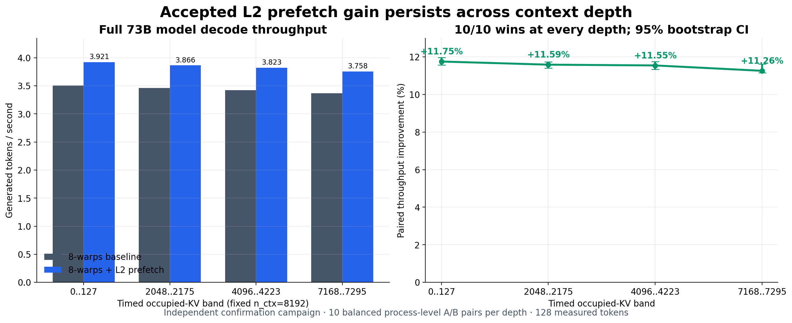

# K2-GX10

Last summer, I wanted to learn how to optimize model inference on my NVIDIA
DGX Spark. After speaking with researchers about projects that would make good
use of the machine, I chose to focus on inference optimization in
[`llama.cpp`](https://github.com/ggml-org/llama.cpp).

I used the
[`K2-Think-V2 Q6_K GGUF`](https://huggingface.co/benjaminradio/K2-Think-V2-GGUF)
on a DGX Spark with 128 GB of unified memory.

## Prefill and decode

Model inference has two main phases:

1. **Prefill** reads and processes the input prompt.
2. **Decode** generates the response one token at a time.

My work focused on decode. Each transformer layer contains attention, which
lets the current token use information from earlier tokens, and a feed-forward
network (FFN), which performs additional processing on the current token. The
hot Q6_K matrix-vector kernel was mostly used by the FFN during decode.

## Method

1. Profile the model running in `llama.cpp`.
2. Use **Nsight Systems** to find where GPU time is spent.
3. Use **Nsight Compute** to determine why the hot kernel is slow.
4. Tune one parameter or behavior for the target GPU.
5. Validate correctness and measure every change.

### Nsight Systems

Nsight Systems showed that the Q6_K single-token matrix-vector kernels took a
large share of GPU kernel time, so I focused on that path.

### Nsight Compute

Nsight Compute showed that the hot kernel frequently stalled while waiting for
data from memory. The low L2 hit rate was useful together with the memory-wait
stall measurements: it suggested that upcoming weight data often was not ready
when the warps needed it.

## Accepted changes

### 1. Increase the kernel from four warps to eight warps

A warp is a group of 32 GPU threads. The DGX Spark GPU has 48 streaming
multiprocessors (SMs) and supports up to 48 active warps per SM.

For the simplified one-row view of this matrix-vector operation:

- four warps provide `4 x 32 = 128` threads working on a row;
- eight warps provide `8 x 32 = 256` threads working on a row.

The four-warp version did not expose enough parallel work to hide the time
spent waiting for memory. Eight warps gave the GPU more work that could make
progress while other warps waited.

I did not keep increasing the warp count because more warps also require more
resources and coordination. The correct value had to be measured on the target
GPU.

Result: **+4.67% decode throughput**.

[View the eight-warp patch](https://github.com/cuber-1/travelers-interview-walkthroughs/blob/main/K2-GX10/03-accepted-eight-warps/8-warps.patch)

### 2. Prefetch Q6_K weights into L2 cache

Q6_K packs 256 quantized weights into a 210-byte block. The accepted change
prefetches the next block at byte offsets 0 and 128 so the memory request can
begin before the computation needs that data.

This targets the memory stalls found in Nsight Compute. Instead of waiting to
request the next weights at the moment they are needed, the kernel asks for
them earlier and gives the memory system time to place them closer to the GPU.

Result over the already-eight-warp version: **+10.46% decode throughput**.

[View the L2-prefetch patch](https://github.com/cuber-1/travelers-interview-walkthroughs/blob/main/K2-GX10/04-accepted-prefetch/prefetch-0-128.patch)

## Failed attempt

I also tried having one block process two output rows at once. The idea was to
give each block more work and improve GPU utilization. However, the change
required more registers and shared memory, which reduced how many blocks could
run at the same time. It failed the resource gate, so I rejected it instead of
moving it into full-model testing.

## Testing

I used controlled A/B testing between the baseline and modified builds. I also
reversed the run order across pairs to reduce temperature, clock, and time-order
bias. Every accepted change had to preserve correctness and show a repeatable
performance improvement.

## Final results

| Comparison | Decode throughput improvement |
|---|---:|
| Four warps to eight warps | **+4.67%** |
| L2 prefetch added to eight warps | **+10.46%** |
| Original baseline to final combined version | **+17.49%** |

The final direct full-model comparison improved decode throughput from
**3.2383 to 3.8046 tokens per second**, with the optimized version winning all
five paired comparisons.

The staged percentages use different benchmark campaigns, so they should not
be added together. The final number comes from a separate direct comparison of
the original four-warp baseline against the combined eight-warp and L2-prefetch
version.

