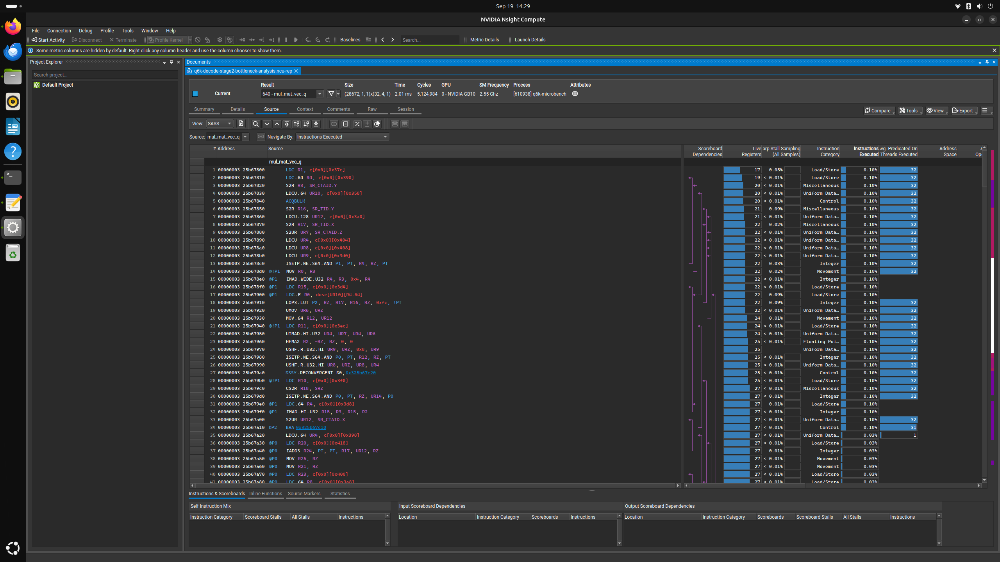

# Nsight Compute walkthrough

These are real screenshots from the saved pre-optimization fused-decode report on the NVIDIA
GB10. The report contains exactly one profiled
`mul_mat_vec_q<Q6_K, 1, true, false>` launch. It is the isolated equivalent of the Q6_K
up/gate projection work repeatedly executed during one-token model decode.

## What code produces this report?

```text
scripts/build_q6k_microbench.sh
        |
        v
src/q6k-microbench.cpp builds a real GGML graph
        |
        v
Q6_K up projection + Q6_K gate projection + fused SwiGLU
        |
        v
llama.cpp dispatches mul_mat_vec_q<Q6_K, 1, true, false>
        |
        v
scripts/profile_ncu_microbenchmark.sh runs one launch under ncu
        |
        v
q6k-decode-stage2-bottleneck-analysis.ncu-rep
```

The important files are:

- [`src/q6k-microbench.cpp`](../src/q6k-microbench.cpp): creates Q6_K weight tensors and a
  one-column activation, builds the up/gate/SwiGLU graph, runs CPU and CUDA backends, records
  timing, and rejects the result if CPU-versus-GPU NMSE exceeds `5e-4`;
- [`scripts/profile_ncu_microbenchmark.sh`](../scripts/profile_ncu_microbenchmark.sh): selects
  the exact fused kernel, limits collection to one launch, collects the Nsight Compute sections,
  and validates the saved report;
- [`scripts/build_q6k_microbench.sh`](../scripts/build_q6k_microbench.sh): builds the benchmark
  against the pinned llama.cpp GGML CUDA backend; and
- [`patches/q6k-gb10-decode-final.patch`](../patches/q6k-gb10-decode-final.patch): contains the
  production CUDA changes—exact-GB10 dispatch, eight warps for Q6_K `N=1`, and next-block L2
  prefetches for both up and gate weights.

This separation is intentional: the benchmark reproduces the operation, llama.cpp owns the CUDA
kernel, the patch contains the optimized code, and the profiling wrapper measures one exact launch.

## 1. Selected-kernel summary


Key observations:

- the report contains one selected kernel result, not an average over unrelated GPU work;
- the launch shape is grid `(28672, 1, 1)` and block `(32, 4, 1)` for the four-warp baseline;
- duration is about `2.01 ms`, with `46` registers per thread; and
- both compute and memory throughput read `14.29%`, so peak arithmetic or bandwidth saturation
  alone does not explain the latency.

Nsight Compute's `47.25%` estimated speedup is a diagnostic upper bound, not a measured project
result. The project accepts improvements only from repeated A/B timing.

## 2. Bottleneck details


This view supplies the evidence that led to the optimization:

- L2 hit rate is only `7.20%`;
- long-scoreboard stalls are `54.8` cycles per issued instruction, meaning warps spend most of
  their issue interval waiting for memory dependencies;
- compute and memory throughput are both only `14.29%`; and
- the kernel already has `73.15%` achieved occupancy (`83.33%` theoretical), so simply chasing
  occupancy was not the full answer.

That combination suggested increasing independent in-flight work with eight warps and requesting
the next Q6_K weight lines into L2 before their demand loads.

## 3. Compiled instruction view



The source pane is displaying SASS, the GPU instructions emitted by the compiler. The right-hand
columns correlate instructions with live registers, scoreboard dependencies, stall samples, and
instruction categories. This view is useful evidence that the investigation reached the compiled
kernel rather than stopping at Python or high-level model code. It is not necessary to explain
individual SASS instructions to understand the optimization rationale.

## Reproduce or open it locally

Build and run the operation without the profiler:

```bash
./scripts/build_q6k_microbench.sh
./build-microbenchmark/q6k-microbench \
  --execute --columns 1 --fused-swiglu --warmup 20 --iterations 100
```

Preview the exact profiler command and safety limits without executing it:

```bash
./scripts/profile_ncu_microbenchmark.sh --plan --decode-fused
```

The completed local report can be opened with:

```bash
ncu-ui profiles/ncu-microbenchmark/q6k-decode-stage2-bottleneck-analysis.ncu-rep
```

Generating a fresh report requires access to privileged GPU performance counters and invokes the
guarded Stage 2 command documented by the plan. The saved report and committed screenshots can be
used when profiling access is unavailable. Raw `.ncu-rep` files are intentionally ignored
because they are machine-specific, while the screenshots and metric extracts are reviewable in Git.

## Optimization rationale

Nsight Systems identified the hot kernel family. The fused Q6_K decode operation was then reproduced
in a bounded C++ GGML microbenchmark and isolated with a one-launch Nsight Compute filter. The report
showed high occupancy but a 7.2% L2 hit rate and dominant long-scoreboard stalls, indicating that
warps were waiting on global-memory dependencies. That evidence motivated testing more warp-level
parallelism and next-block L2 prefetching. The patch was accepted only after CPU/GPU correctness
checks, repeated isolated A/B pairs, fresh-process full-model tests, and long-context confirmation.
