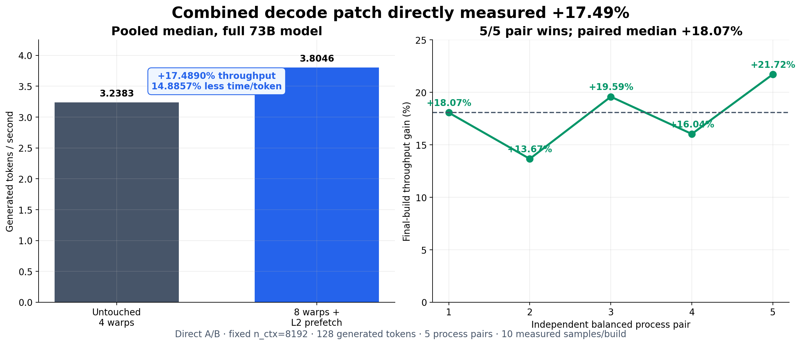

# Visual profiler and benchmark results

The figures on this page are generated by
[`scripts/generate_readme_visuals.py`](../scripts/generate_readme_visuals.py)
from compact committed CSV/JSON extracts. The original multi-gigabyte profiler
and build artifacts remain local and are intentionally excluded from Git.

## Accepted decode improvement



The direct same-campaign A/B compared untouched four-warps against the final
eight-warps-plus-L2-prefetch build. Pooled medians were 3.238285 and 3.804630
tok/s respectively: **+17.4890% throughput** and **14.8857% less decode time
per token**. All five balanced process pairs won; their median gain was
+18.0678%, with a range of +13.6657% to +21.7233%.

Each process used the full 73B Q6_K model, fixed `n_ctx=8192`, Flash Attention,
CUDA graphs, f16 K/V, 128 generated tokens, and two measured repetitions after
the built-in warm-up. Source:
`results/q6k-decode-combined-20260824/summary-direct.json`.


The accepted 0/128-byte L2 prefetch improves the already-eight-warp build at
every tested context depth. The confirmation used fixed `n_ctx=8192`, f16 K/V,
Flash Attention, CUDA graphs, 128 measured tokens, and ten independent balanced
process-level A/B pairs at every depth.

Source: `results/q6k-decode-long-context-20260818/summary-repeat.json`.

## Nsight Systems: which kernels consume the time


In the mixed short-prefill plus decode capture, the two optimized `N=1` Q6_K
MMVQ variants account for 57.6% of captured GPU kernel time. All Q6_K
matrix-multiply/vector kernels together account for 98.2%. In the isolated
fused decode operation, the exact target kernel occupies 99.8% of GPU kernel
time and Q8_1 quantization only 0.2%.

This is why optimizing `mul_mat_vec_q<Q6_K, N=1>` moved full-model generation:
it is a narrowly scoped kernel family invoked throughout the 73B model.

Sources:

- `profiles/nsys/k2-20260817-211725-graph-nodes-stats.txt`, CUDA GPU Kernel
  Summary;
- `results/q6k-decode-baseline/n1-fused-swiglu-stats.txt`, CUDA GPU
  Kernel/Grid/Block Summary.

The percentages describe GPU kernel time inside each capture, not complete HTTP
request wall time. The mixed capture contains both eager short-prefill work and
graph-node decode work.

## Nsight Compute: why L2 prefetch was selected


The exact fused Q6_K decode kernel had healthy achieved occupancy but poor issue
utilization and a 7.2% L2 hit rate. Long-scoreboard stalls dominated at 54.83
warp cycles per issued instruction, followed by global-load throttling at
18.40. Nsight Compute also reported 22,249,472 excessive global sectors out of
53,473,280 theoretical sectors, or 41.61%.

That profile motivated two complementary changes:

1. eight warps expose more independent work while some warps wait; and
2. distance-one L2 hints request the next Q6_K weight cache lines while the
   current dot-product iteration is still executing.

Source:
`profiles/ncu-microbenchmark/q6k-decode-stage2-bottleneck-analysis-details.txt`.

## Why a larger prefill input eventually stops helping


Increasing the number of activation columns initially amortizes launch and
tiling overhead, but throughput peaks around `N=1024` for this isolated shape
and then declines. That is why the project tested larger inputs rather than
assuming that the largest possible microbatch was optimal. No prefill source
change ultimately passed both the numerical and performance gates.

Source: `docs/data/q6k-column-sweep.csv`, copied from the preserved verified
column sweep.

## Regenerate

```bash
python3 -m pip install -r requirements-visuals.txt
python3 scripts/generate_readme_visuals.py
```

The script writes both PNG files for GitHub rendering and SVG files for
lossless inspection under `docs/assets/`.
