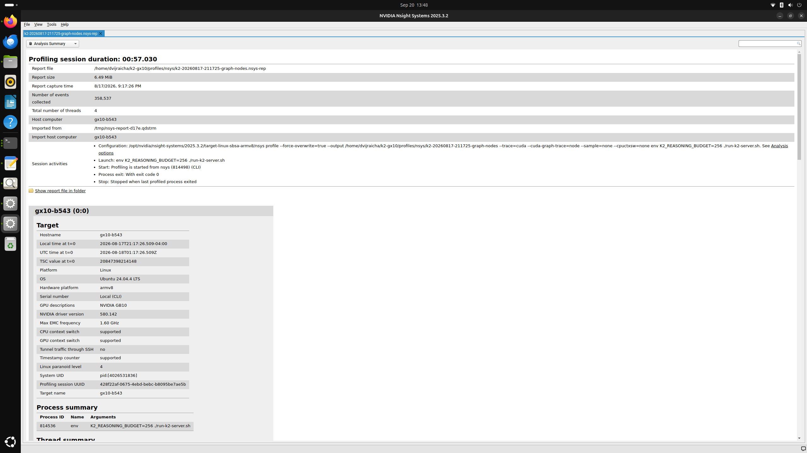
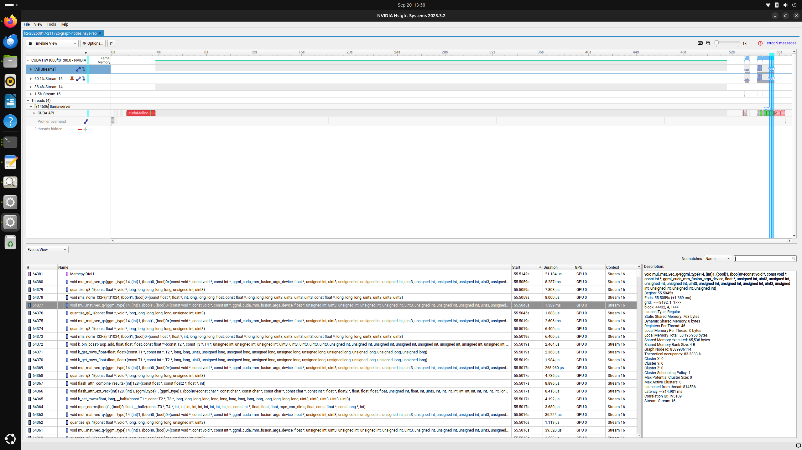
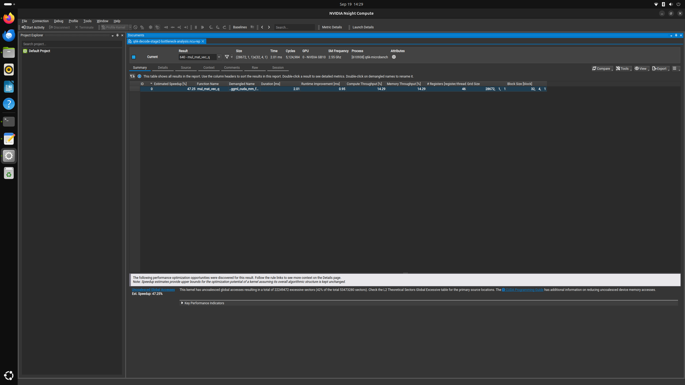
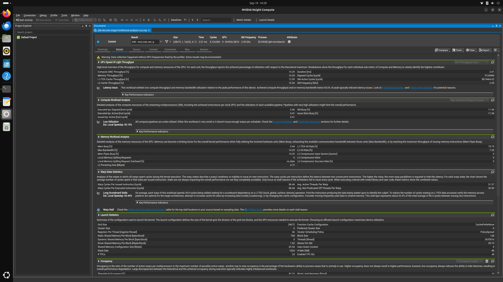

# K2-GX10: chronological interview walkthrough

Use this page as the start of the repository tour. It follows the project in
the order the work actually happened: identify the model and baseline, run the
real workload, find the hot kernel, isolate it, diagnose it, change it, and
validate the result.

This is an **inference optimization** repository, not a model-training
repository. There is no `model.py` or `training.py` to present. The important
code is a llama.cpp launcher, profiler harnesses, a C++ microbenchmark, a CUDA
patch, and the A/B measurement scripts.

## The 30-second project summary

> I ran the 73B K2-Think-V2 Q6_K model through llama.cpp on an NVIDIA GB10. A
> CUDA-graph-node Nsight Systems capture showed that the Q6_K single-token
> matrix-vector family consumed 642.679 of 654.441 milliseconds of kernel time,
> or 98.20%. Nsight Compute then showed long-scoreboard and global-load stalls
> with only a 7.20% L2 hit rate. I changed only the GB10 Q6_K `N=1` decode path:
> four to eight warps per block, then bounded L2 prefetches at byte offsets 0
> and 128. A direct full-model A/B measured 3.238285 to 3.804630 tokens/second,
> a 17.4890% throughput increase, with five out of five process-pair wins. I
> checked numerical correctness, resource use, isolated timing, full-model
> timing, and performance through a 7,168-token KV-cache depth.

## Interview route

If the interviewer asks to see the repository, open these in order:

1. This README and the [model launcher](../run-k2-server.sh).
2. The [Nsight Systems capture script](../scripts/profile_nsys.sh) and the two
   real screenshots below.
3. The [graph-node analyzer](analyze_nsys_graph_nodes.py) that produces the
   98.20% number.
4. The [isolated C++ microbenchmark](../src/q6k-microbench.cpp).
5. The [final CUDA patch](../patches/q6k-gb10-decode-final.patch).
6. The [direct full-model runner](../scripts/run_combined_decode_ab.sh) and
   [result](../results/q6k-decode-combined-20260824/RESULT.md).
7. The [long-context result](../results/q6k-decode-long-context-20260818/RESULT.md)
   and the rejected experiments near the end of this page.

That route is enough for an 8-12 minute walkthrough. Go into the deeper files
only when the interviewer asks.

## 1. Start with the exact model and software baseline

The inference model was the four-shard, 55.43 GiB Q6_K GGUF from
[`benjaminradio/K2-Think-V2-GGUF`](https://huggingface.co/benjaminradio/K2-Think-V2-GGUF).
The original model is
[`LLM360/K2-Think-V2`](https://huggingface.co/LLM360/K2-Think-V2).
The cached GGUF snapshot was
`3064ec56b7c735f4f133aa10cfcca3ef3bd718f7`, and the starting llama.cpp tree
was build 10380 at commit `0b1bad14f`.

The repository's [baseline diagnosis](../README.md#diagnosis) records the model
snapshot, shard count, total size, and llama.cpp revision. The GGUF weights
themselves are intentionally not committed because of their size.

Q6_K is a llama.cpp block quantization format. Each 256-weight block occupies
210 bytes: 128 bytes of low bits, 64 bytes of high-bit data, 16 bytes of
scales, and a two-byte FP16 delta. That is 6.5625 effective bits per weight.
During single-token generation, these compressed weight blocks are read and
dequantized inside a matrix-vector kernel.

What to say:

> I froze the model snapshot, llama.cpp revision, build artifacts, and hardware
> state before comparing code. That made the CUDA change the controlled
> variable.

## 2. Run the real model first

[`run-k2-server.sh`](../run-k2-server.sh) starts `llama-server` with all model
layers offloaded to CUDA. [`client_test.py`](../client_test.py) sends a
deterministic request and asserts that the response finishes correctly.

```bash
export K2_MODEL=/path/to/K2-Think-V2-Q6_K-00001-of-00004.gguf
export LLAMA_SERVER=/path/to/llama-server
./run-k2-server.sh

# In a second terminal:
./client_test.py
```

The serving fix and the CUDA optimization are separate parts of the repository.
The launcher bounds K2's reasoning phase; it is not responsible for the kernel
speedup.

## 3. Capture the actual decode workload with Nsight Systems

The code that runs this profile is
[`scripts/profile_nsys.sh`](../scripts/profile_nsys.sh). The important mode is:

```bash
./scripts/profile_nsys.sh --graph-nodes
```

It performs these actions in one guarded script:

1. verifies the tools and that the server port is free;
2. launches the real K2 server under `nsys profile`;
3. enables `--cuda-graph-trace=node` so kernels replayed from CUDA graphs are
   visible rather than hidden behind one graph launch;
4. waits for the health endpoint;
5. sends one bounded, deterministic four-token request;
6. stops only that profiler process group; and
7. writes both the `.nsys-rep` report and a text stats summary.

This is a real screenshot of the saved 57.030-second capture. It shows the
profile command, report metadata, Ubuntu ARM64 target, and NVIDIA GB10:



The raw `.nsys-rep` is 6.49 MiB and is locally reproducible but ignored by Git
because profiler databases grow quickly. The screenshots, commands, analyzer,
and compact numerical results are committed.

## 4. Find the hot kernel

Open the report in Nsight Systems, expand `CUDA HW`, right-click the dominant
stream, and choose **Show in Events View**. The real capture below shows the
repeated `mul_mat_vec_q<(ggml_type)14,...>` launches. The selected launch is
the `N=1` fused decode specialization and took 1.389 ms in this replay.



The GUI establishes where the repeated work occurs. The exact percentage comes
from exporting the report to SQLite and summing graph-node durations with this
folder's [`analyze_nsys_graph_nodes.py`](analyze_nsys_graph_nodes.py):

```bash
nsys export --type sqlite \
  --output profiles/nsys/k2-graph-nodes.sqlite \
  profiles/nsys/k2-graph-nodes.nsys-rep

python3 walkthrough/analyze_nsys_graph_nodes.py \
  profiles/nsys/k2-graph-nodes.sqlite
```

Output from the preserved capture:

```text
All graph-node kernels: 3052 rows, 654.441 ms
Q6_K MMVQ kernels:       962 rows, 642.679 ms
Q6_K share:               98.20%

Largest graph-node groups:
 338.001 ms   160 launches  gridX=28672  block=(32,4,1)  Q6_K fused
 226.135 ms   318 launches  gridX=8192   block=(32,4,1)  Q6_K fused
  48.561 ms   162 launches  gridX=8192   block=(32,4,1)  Q6_K nonfused
  17.608 ms     2 launches  gridX=250112 block=(32,4,1)  Q6_K nonfused
  12.374 ms   320 launches  gridX=1024   block=(32,4,1)  Q6_K nonfused
```


There is no class that magically found the kernel. The chain is:

```text
profile_nsys.sh
  -> Nsight Systems CUPTI trace
  -> CUPTI_ACTIVITY_KIND_KERNEL rows in SQLite
  -> analyze_nsys_graph_nodes.py groups durations by demangled kernel name
  -> mul_mat_vec_q<Q6_K, N=1, ...> = 98.20%
```

`(ggml_type)14` is llama.cpp's compiled enum value for Q6_K in this revision.
`N=1` means one output column: the single-token decode case. This is a
matrix-vector path. Prompt ingestion uses larger `N` values and can dispatch to
matrix-matrix kernels instead. llama.cpp chooses between those paths from the
tensor shape and quantization type; merely compiling a kernel does not make it
hot.

The corresponding pinned upstream sources are the
[`mmvq.cu` implementation](https://github.com/ggml-org/llama.cpp/blob/0b1bad14ff204627636aeb1de22ddcd5acb859d4/ggml/src/ggml-cuda/mmvq.cu)
and the [Q6_K vector-dot helpers](https://github.com/ggml-org/llama.cpp/blob/0b1bad14ff204627636aeb1de22ddcd5acb859d4/ggml/src/ggml-cuda/vecdotq.cuh).

## 5. Reproduce only the hot operation

[`src/q6k-microbench.cpp`](../src/q6k-microbench.cpp) is not a miniature
language model. It builds the same GGML operation graph and uses the same CUDA
backend and kernel, but allocates deterministic synthetic tensors instead of
loading 55.43 GiB of model weights.

The most useful code to explain is:

| Symbol | Purpose |
|---|---|
| `Sizes` | Computes bounded allocations and refuses unsafe dimensions. |
| `run_backend` | Creates Q6_K weights and FP32 input, builds `ggml_mul_mat`, optionally adds the up/gate SwiGLU graph, warms up, synchronizes, and records repeated timings. |
| `RunResult` | Carries output values and median/min/max latency. |
| `nmse` | Compares CUDA output with the CPU reference. |
| `main` | Parses guarded dimensions and selects CPU/CUDA execution. |

The fused graph is the feed-forward-network up projection and gate projection
followed by SwiGLU. Both projections read Q6_K weights; the gate controls how
much of the up-projection signal passes forward.

```bash
./build-microbenchmark/q6k-microbench \
  --execute --columns 1 --fused-swiglu --warmup 20 --iterations 100
```

The representative isolated fused operation was 1.980 ms. Its one-launch
Nsight Systems time was 1.994 ms, close to the full-model grid's 1.937 ms
median. That shape match is why the microbenchmark is relevant; it is not a
hard-coded constant.

## 6. Diagnose the bottleneck with Nsight Compute

[`scripts/profile_ncu_microbenchmark.sh`](../scripts/profile_ncu_microbenchmark.sh)
profiles exactly one matching fused launch and includes allocation, ownership,
kernel-filter, timeout, and launch-count guards.





The representative baseline measured:

| Metric | Value | Interpretation |
|---|---:|---|
| Kernel duration | 2.007 ms | The isolated target launch. |
| Registers per thread | 46 | Register pressure was not extreme. |
| Theoretical / achieved occupancy | 83.33% / 73.15% | Enough active warps existed, but they often waited. |
| Compute / memory throughput | 14.29% / 14.29% | Neither peak compute nor peak bandwidth was saturated. |
| Long-scoreboard stall | 54.83 cycles/issue | Warps frequently waited for dependent global-memory data. |
| Global-load throttle | 18.40 cycles/issue | Outstanding load pressure also delayed issue. |
| L2 hit rate | 7.20% | Most requested weight data was not already in L2. |
| Excess global sectors | 42% | Weight access/coalescing was expensive. |

That evidence suggested a latency/available-parallelism problem, not a dense
matrix-multiply compute problem.

## 7. Make the two accepted CUDA changes

Both accepted changes are in one reviewable file:
[`patches/q6k-gb10-decode-final.patch`](../patches/q6k-gb10-decode-final.patch).

### Change A: four warps to eight

The original generic `N=1` configuration selected four warps. The patch adds a
Blackwell parameter-table entry and makes one narrow selection:

```cpp
if (table_id == MMVQ_PARAMETERS_BLACKWELL &&
        type == GGML_TYPE_Q6_K && ncols_dst == 1) {
    return 8;
}
```

Eight warps means 256 threads instead of 128 threads in the CUDA block. It
increases the independent work available while some warps wait on weight data.
The isolated fused test improved 5.10%, with 10/10 paired wins. The historical
standalone patch is
[`q6k-blackwell-decode-8-warps.patch`](../patches/q6k-blackwell-decode-8-warps.patch).

Why was this not already the default? The pinned llama.cpp revision used a
generic parameter table for this path; it did not contain a measured GB10 Q6_K
single-column specialization. The kernel already existed—this change tunes its
launch configuration for the measured hardware/workload.

### Change B: prefetch the next weight block

The second change adds a device helper containing two
`prefetch.global.L2` hints at byte offsets 0 and 128, then calls it for the next
bounded Q6_K block. The fused path issues the hints for both up and gate
weights. Prefetching is only a hint; arithmetic and output values do not change.

The first two cache-line regions cover the high-value parts of the 210-byte
Q6_K block early enough to overlap some memory latency. The accepted isolated
fused gains over the eight-warp baseline were 14.4912% and 14.4433% in two
independent campaigns, each with 10/10 wins.

## 8. Validate each change before trusting speed

The validation ladder was:

1. **Build and static resources:** confirm the target specialization compiled,
   inspect registers/shared memory/local memory, and reject resource cliffs.
2. **CPU reference:** require normalized mean squared error at or below
   `5e-4`; the fused path was about `3.25e-5`.
3. **Candidate versus baseline bytes:** the accepted prefetch outputs were
   byte-identical and had matching SHA-256 hashes.
4. **Isolated paired timing:** warm up 20 times, time 100 iterations, start a
   fresh process for each side, and alternate `A/B` then `B/A` order to reduce
   thermal and clock drift.
5. **Full 73B model A/B:** compare tokens/second with the same model, context,
   generated-token count, Flash Attention, K/V types, and process protocol.
6. **Long-context confirmation:** repeat at KV depths 0, 2048, 4096, and 7168
   to make sure the improvement survives realistic cache growth.

“Paired” means baseline and candidate runs are matched under the same test
conditions. Alternating which build runs first prevents one build from always
benefiting from a cold machine or always suffering from later heat.

The full runner is
[`scripts/run_combined_decode_ab.sh`](../scripts/run_combined_decode_ab.sh).
Its `run_one` function fixes the work, records provenance, and emits JSON. The
[`analyzer`](../scripts/analyze_combined_decode_ab.py) validates the expected
ten process results and computes medians and pair wins.

## 9. Report the results without mixing baselines

| Comparison | Scope | Result |
|---|---|---:|
| Untouched four warps -> final eight warps + prefetch | Direct full-model A/B | **3.238285 -> 3.804630 tok/s, +17.4890%, 5/5 wins** |
| Four warps -> eight warps | Earlier isolated fused attribution | **+5.10%, 10/10 wins** |
| Eight warps -> prefetch | Earlier full-model attribution | **3.549480 -> 3.920885 tok/s, +10.4636%** |
| Eight warps -> prefetch | Isolated fused repeats | **+14.4912% and +14.4433%, 10/10 wins each** |
| Eight warps -> prefetch at depth 0 | Full-model confirmation | **+11.7542%, 10/10 wins** |
| Eight warps -> prefetch at depth 7168 | Full-model confirmation | **+11.2610%, 10/10 wins** |

The direct result is the headline. Do not add 5.10% and 14.49%, because those
are isolated staged measurements with a different metric and baseline. Also,
17.4890% more throughput corresponds to 14.8857% less time per token; it is not
17.4890% lower latency.

Primary evidence:

- [Direct combined A/B report](../results/q6k-decode-combined-20260824/RESULT.md)
- [Machine-readable direct summary](../results/q6k-decode-combined-20260824/summary-direct.json)
- [Prefetch stage result](../results/q6k-decode-prefetch-0-128/RESULT.md)
- [Long-context confirmation](../results/q6k-decode-long-context-20260818/RESULT.md)
- [Complete final summary](../docs/final-results.md)

## 10. Explain the three most useful rejected ideas

| Experiment | What changed | Measurement | Why rejected |
|---|---|---|---|
| [Two output rows per block](../results/q6k-decode-rpb2/RESULT.md) | One block computes two rows while keeping eight warps. | Fused registers rose 46 -> 56, shared memory 2816 -> 4608 bytes, and theoretical occupancy fell 83.33% -> 66.67%. | It failed the preregistered resource gate, so timing it would not justify advancing it. |
| [Third prefetch at byte 208](../results/q6k-decode-prefetch-0-128-208/RESULT.md) | Added one hint after the accepted 0/128 hints. | +0.0612% paired median, 5/10 wins, 95% interval `[-0.8235%, +1.3176%]`. | Statistically and practically neutral; the simpler two-hint version stayed. |
| [Cooperative FFN megakernel](../results/q6k-decode-ffn-megakernel/RESULT.md) | Combined the up, gate, and SwiGLU work into a cooperative launch. | Initial form -4.3344%, occupancy follow-up -4.6900%, both 0/10 wins. | It saved small launch overhead but retained the large weight scans and added synchronization cost. |

These failures show the engineering process: form one-variable hypotheses,
declare gates first, preserve evidence, and keep only changes that are correct
and repeatably faster.

## 11. What is actually in GitHub

Committed:

- the exact final and historical patches;
- the real profiler screenshots in this walkthrough and the Nsight Compute
  screenshots under `docs/assets/`;
- profiler, microbenchmark, validation, and analysis source;
- compact results, raw timing samples where practical, hashes, ordering logs,
  and environment records.

Not committed:

- 55.43 GiB of GGUF weights;
- build directories and duplicate llama.cpp worktrees;
- large raw `.nsys-rep`, `.ncu-rep`, and generated SQLite databases.

That boundary is deliberate. A reviewer can inspect the exact code and numeric
evidence on GitHub, then regenerate the large machine-specific artifacts on a
GB10.

## 12. A clean closing answer

> The main lesson was to optimize the measured path, not the most impressive
> looking kernel. I first made CUDA graph nodes visible, proved Q6_K `N=1`
> matrix-vector decode was 98.20% of recorded kernel time, reproduced its shape
> in a bounded benchmark, and used Nsight Compute to identify memory-dependency
> stalls. I tried narrow changes, rejected the ones that failed resource or
> paired-timing gates, and confirmed the accepted eight-warp plus L2-prefetch
> patch on the full 73B model and across context depth.

For a source-focused follow-up, continue with the shorter
[`docs/code-walkthrough.md`](../docs/code-walkthrough.md) and the detailed
[`docs/nsight-compute-walkthrough.md`](../docs/nsight-compute-walkthrough.md).
